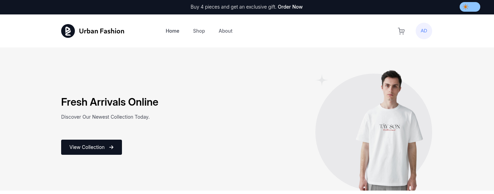

#  **Urban Fashion**


> This project was created as the third challenge of the Compass Uol scholarship program, aiming to improve technical skills in Front end development with the creation of an eccommerce.

**Urban Fashion** is an eccommerce focused on selling clothes and accessories, the website was developed according to the requirements requested by the project's PO.

---

## 📄 **Project requirements**

- [x] **Development of several pages**
- [x] **User authentication implementation**
- [x] **Zip code search api implementation**
- [x] **Shopping cart status management**
- [x] **Responsive layout**

## 📄 **Optional requirements**

- [x] **Light and dark themes**
- [x] **password recovery page**
- [ ] **automated tests**


---

## 💻 **Technologies Used**

This project was developed using the following technologies:

- ###  React
          
- ###  Tailwind 
- ###  Axios

- ###  JSON Server

- ###  Redux


- ###  Typescript


- ###   Clerk


## 🛠️ Installation and Setup

1. Clone this repo

```bash
git clone https://github.com/AdrianaRaubach/aws_react_dez24_d03
```

2. Install the packages and dependencies using npm

```bash
npm install
```

3. Enter your API Key in .env

```
VITE_CLERK_PUBLISHABLE_KEY=your-key-here
```

4. Start json server

```bash
npx json-server db.json
```

5. Start the server

```bash
npm run dev
```

6. Visit the app

```
localhost:5173
```


### ⚙️  For authentication with the clerk and Google to work correctly, you need to follow the dedicated guide step by step:


- ####  [Dedicated guide](https://clerk.com/docs/authentication/social-connections/google#configure-for-your-production-instance)


## ✏️ Author

- [Adriana Raubach](https://github.com/AdrianaRaubach)